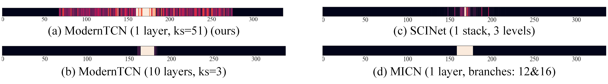
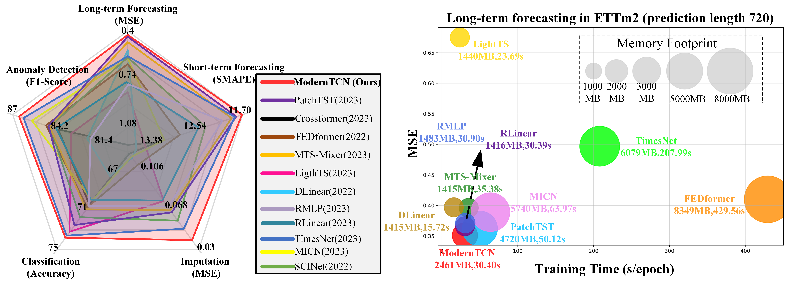

# ModernTCN (ICLR 2024 Spotlight)
This is an official implementation of paper: [ModernTCN: A Modern Pure Convolution Structure for General Time Series Analysis](https://openreview.net/forum?id=vpJMJerXHU#).

## Our Paper
Donghao Luo and Xue Wang. ModernTCN: A Modern Pure Convolution Structure for General Time Series Analysis. In International Conference on Learning Representations, 2024.
[[Our paper in OpenReview]](https://openreview.net/forum?id=vpJMJerXHU#).

We study the open question of how to better use convolution in time series analysis and we take a seldom-explored way in time series community to successfully bring convolution back to time series analysis.

As a pure convolution structure, our ModernTCN achieves the consistent state-of-the-art performance on five mainstream time series analysis tasks (long-term and short-term forecasting, imputation, classification and anomaly detection) while maintaining the efficiency advantage of convolution-based models, therefore providing a better balance of efficiency and performance.

## ModernTCN Block

**ModernTCN block design:** 
ModernTCN block can achieve larger ERF and better capture the cross-variable dependency, therefore being more suitable for time series analysis.

| | 
|:--:|:--:|
| *Figure 1. ModernTCN block design.* | *Figure 2. Visualization of ERF.* |

## Main Results

**Main Results:** 
Our ModernTCN achieves the consistent state-of-the-art performance on five mainstream time series analysis tasks with better efficiency.

## Get Started

1. Install Python 3.7 and necessary dependencies.
```
pip install -r requirements.txt
```
2. Download data. You can obtain all datasets from [[Times-series-library](https://github.com/thuml/Time-Series-Library)].

3. Long-term forecasting tasks.
 
We provide the long-term forecasting experiment coding in `./ModernTCN-Long-term-forecasting` and experiment scripts can be found under the folder `./scripts`. To run the code on ETTh2, just run the following command:

```
cd ./ModernTCN-Long-term-forecasting

sh ./scripts/ETTh2.sh
```

4. Short-term forecasting tasks.

We provide the short-term forecasting experiment coding in `./ModernTCN-short-term` and experiment scripts can be found under the folder `./scripts`. Please run the following command:

```
cd ./ModernTCN-short-term

sh ./scripts/M4.sh
```

5. Imputation tasks.

We provide the imputation experiment coding in `./ModernTCN-imputation` and experiment scripts can be found under the folder `./scripts`. To run the code on ETTh2, just run the following command:

```
cd ./ModernTCN-imputation

sh ./scripts/ETTh2.sh
```

6. Classification tasks.

We provide the classification experiment coding in `./ModernTCN-classification` and experiment scripts can be found under the folder `./scripts`. Please run the following command:

```
cd ./ModernTCN-classification

sh ./scripts/classification.sh
```

7. Anomaly detection tasks.

We provide the anomaly detection experiment coding in `./ModernTCN-detection` and experiment scripts can be found under the folder `./scripts`. To run the code on SWaT, just run the following command:

```
cd ./ModernTCN-detection

sh ./scripts/SWaT.sh
```

## Contact
If you have any question or want to use the code, please contact [ldh21@mails.tsinghua.edu.cn](mailto:ldh21@mails.tsinghua.edu.cn).

## Citation

If you find this repo useful, please cite our paper. 
```
@inproceedings{
donghao2024moderntcn,
title={Modern{TCN}: A Modern Pure Convolution Structure for General Time Series Analysis},
author={Luo donghao and wang xue},
booktitle={The Twelfth International Conference on Learning Representations},
year={2024},
url={https://openreview.net/forum?id=vpJMJerXHU}
}
```

## Acknowledgement

We appreciate the following github repos a lot for their valuable code base or datasets:

https://github.com/ts-kim/RevIN

https://github.com/PatchTST/PatchTST

https://github.com/thuml/Time-Series-Library

https://github.com/facebookresearch/ConvNeXt

https://github.com/MegEngine/RepLKNet

